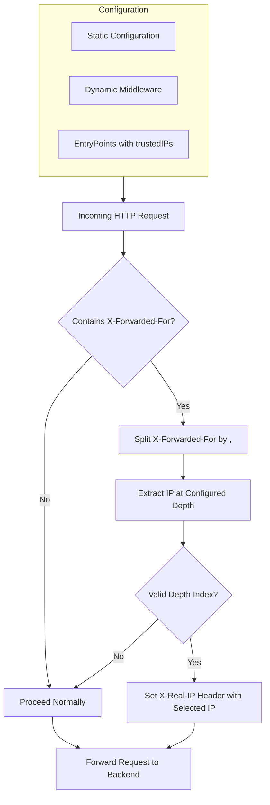

# Project Specification: Traefik X-Real-IP from X-Forwarded-For Plugin

## 1. Overview
This project implements a **Traefik plugin** that intelligently rewrites the `X-Real-Ip` header by extracting a specific IP address from the `X-Forwarded-For` header, based on a configurable index (`depth`). It is particularly useful in environments with multiple proxies where preserving the original client IP is essential.

## 2. Objectives
- **Ensure backend services receive the correct client IP address**.
- Provide a configurable mechanism (`depth`) to extract the desired IP from the `X-Forwarded-For` header.
- Maintain compatibility with Traefik’s plugin system and middleware chaining.

## 3. Features
- Parses `X-Forwarded-For` header and splits it into a list of IPs.
- Selects an IP based on the specified `depth` (default: 0).
- Rewrites the `X-Real-Ip` header with the selected IP.
- Supports both static and dynamic Traefik configurations.
- Requires trusted proxy IPs to be defined in `forwardedHeaders.trustedIPs`.



## 4. Use Cases
- Traefik deployed behind multiple proxies (e.g., Cloudflare tunnels, Docker networks).
- Applications needing accurate client IPs for logging, rate-limiting, or geo-IP services.

## 5. Configuration

### Static Configuration Example:
```yaml
experimental:
  plugins:
    traefik-xff-to-xrealip:
      moduleName: github.com/jeppestaerk/traefik-xff-to-xrealip
      version: v0.1.2
```

### EntryPoints Example:
```yaml
entryPoints:
  web:
    address: ":80"
    forwardedHeaders:
      trustedIPs:
        - "127.0.0.1/32"
        - "192.168.1.5"
        - "172.16.0.0/16"
```

### Dynamic Middleware:
```yaml
http:
  middlewares:
    xff2realip:
      plugin:
        traefik-xff-to-xrealip:
          depth: 1
```

### Router Example:
```yaml
http:
  routers:
    my-app:
      rule: Host(`myapp.example.com`)
      service: my-app
      middlewares:
        - xff2realip@file
```

## 6. Requirements

### Functional Requirements:
- The plugin must run within the Traefik plugin runtime.
- Must correctly modify the `X-Real-Ip` header.
- Configurable `depth` to support various proxy depths.

### Non-Functional Requirements:
- Compatible with Traefik v3.x plugin interface.
- Performance should not degrade Traefik routing latency noticeably.

## 7. Limitations
- Does not validate the authenticity of IPs in `X-Forwarded-For`.
- Requires manual management of `trustedIPs` to ensure security.

## 8. Future Enhancements (Proposed)
- Add support for fallback behavior if the selected IP index is invalid.
- Include CIDR-based validation or whitelisting of client IPs.
- Enhanced logging and debug options.
